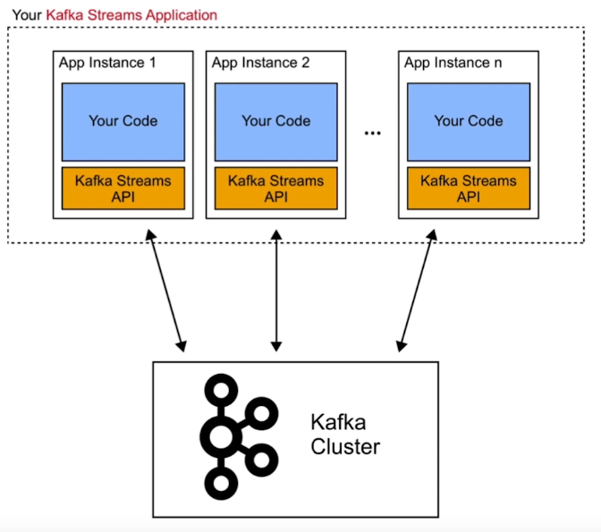

## [What is Apache Kafka?](https://www.youtube.com/watch?v=FKgi3n-FyNU) (quick)

Databases encourage us to think in terms of **things in the world with state**

This worked for decades

But we’re now starting to think in terms of **events**

Events are indications in time that a thing took place

Instead of a database for events, we use logs

A log is an ordered sequence of events

- They are easy to reason about
- They scale well

Kafka is a system for managing these logs

We call these logs **topics**

A topic is an ordered collection of events stored in a durable way (on disk, replicated)

Topics store data for various periods of time (minutes/hours/days/years/forever)

Topics can be small, or enormous 

**Each event is a thing happening in the business**

- A user updates their shipping address
- A thermostat reports temperature increase
- A Ship unloads cargo
- Etc...

Systems used to be **monolithic** ==> but they got too big and complex for programmers

Now we write lots of small programs (microservices) which can talk to each other through :drum: … kafka topics!

Instead of running cumbersome batch processes, we can perform actions (with services) as close to immediate as possible - e.g. in real-time analytics

So far we have: **events, topics, services, real-time analytics**

We also have **Kafka Connect** to help interface with other (legacy) systems (DBs, other products that are not kafka)

KC gets the data into the topic and back out into the DB

It does grouping, aggregating, filtering, enrichment (joins in DB)

Kafka Streams handles the framework and infrastructure to get all that done

## [**Apache Kafka Fundamentals Playlist**](https://www.youtube.com/watch?v=-DyWhcX3Dpc&list=PLa7VYi0yPIH2PelhRHoFR5iQgflg-y6JA) (detailed)

### **2) Motivations & Use Cases**

There has been a paradigm shift towards Event Driven Architectures


To manage this shift, we need:

- A single platform to connect everyone to every event
- A real-time stream of events
- All events stored for historical view

**Apache Kafka** has become the industry standard (?) for real-time event streaming

[35% of the Fortune500 as of today]( https://kafka.apache.org/powered-by)


**Application Examples:**

- **Banking**: Fraud detection - alert on your phone when you make a transaction
- **Banking 2:** Modernising legacy systems - tons of old batch processes ===> now moving towards immediate transactions
- **Automotive**: IoT - cars are distributed systems reporting tons of data, typically built on a real-time event-driven platform
- **Real-time e-Commerce:** Real-time analysis of what each customer is doing
- **Customer 360 (???)**
- **Online Gaming** 
- **Government**
- **Financial Services**

### **3) Apache Kafka Fundamentals**


**Producers** - those client applications that publish (write) events to Kafka


**What’s in a Kafka Cluster?**

**Kafka Brokers** - allows consumers to fetch messages by topic, partition and offset.

  

Brokers can be thought of in legacy terms as machines, or servers

**Consumers** - subscribe to (read and process) these events


**Consumers, producers, Clusters (brokers)**

and **Zookeeper!**

****


Zookeeper will eventually be deprecated 

**Producers** and **Consumers** are decoupled ===> they know nothing of each other

They don’t affect each other: 

- Slow consumers don’t make slow producers (vice versa)
- They scale independently 

A **Topic** is a collection of related messages (a log)


You can, in theory, have unlimited topics

**Partitions**


Split a topic up into partitions, which are allocated to brokers. This is what allows Kafka to scale.

Actually, a partition is a log (not a topic)

Partitions are ordered

Another view of partitions


What is a log?


Logs are only appended too

Logs are immutable


Topics can have a TTL (an expiry date)

Topics are also known as streams 

Every event (message) is a key-value pair

Every message has a timestamp


Brokers manage partitions:

- Messages of topic are spread across partitions
- Partitions are spread across Brokers
- Each broker handles many partitions
- Each partition is stored on a Broker’s disk
- Partition {1..n log files}
- Each message in the log is identified by an *offset*
- Configurable retention policy


Broker’s are replicated (leader-follower strategy)

Producers write data as messages

Producers can be written in several languages

- Java (native), c/c++, python, go, .net, jms, …
- And more… (JS, etc.)
- REST proxy for unsupported languages

There is also a CLI producer tool

**Load Balancing and Semantic Partitioning**

Producers use a **partitioning strategy** to assign each message to a partition

- Load balancing
- Semantic partitioning

Partitioning strategy is specified by the producer

- Default: *hash(key) % number_of_partitions (% = mod)*
- No key → Round-Robin

^ Messages of the same key always land in order

Custom partitioner possible

**Consumer Basics**

Consumers pull messages from 1..n topics

New inflowing messages are automatically retrieved

Consumer offset (incase something falls down):

- Keeps track of the last message read
- Is stored in special topic

CLI tools exist to read from cluster

**Distributed Consumption**

****

**Every system you’ll ever build conforms to this diagram:**

****

### **4) How Kafka Works**

[BasicProducer.java](https://youtu.be/jY02MB-sz8I?t=50) and [Consumer](https://youtu.be/jY02MB-sz8I)


Topic1 is replicated over four brokers

Topic1 is the leader; the rest are followers 

 What happens when one broker goes offline? 


Events are immutable

But, you don’t have the store them forever

Depends on: resources, Cost, GDPR, Business decisions, etc.

The default retention period is 7 days

**Producer Design**


**At most once / At least once / Exactly once Paradigm**


Idempotent - Gives the same result when performed

**Exactly Once Semantics**

What?

- Strong **transactional guarantees** for Kafka
- Prevents clients from processing duplicate messages
- Handles failures gracefully

**Use Cases**

- Tracking ad views
- Processing financial transactions
- Stream processing

**Consumer Groups**

One consumer group with two instances of the same consumer


[Consumer Groups](https://youtu.be/jY02MB-sz8I) - What happens when the composition of the group changes?

**Compacted Topics** 

****

^ Good when you’re interested in the most recent value

**Troubleshooting**

- Confluent Control Center
- Log Files
- Special Config Settings
- SSL logging
- Authorizer debugging

**Security** 

- Kafka supports encryption in transit
- Kafka supports authentication and authorisation
- No encryption at Rest out of the box!
- Clients can be mixed with & without Encryption & Authentication

### 5) Integrating Kafka into Your Environment

What is Kafka (really basic definition) - a distributed log with *producers* and *consumers* 

**Kafka Connect** is a data integration framework - gets data in and out of Kafka to systems which aren’t Kafka


**Sources and Sinks**

****

**Kafka Connect** runs in tasks across workers 


In general, connectors can be parallized

**Confluent REST proxy** - a REST wrapper around the producer and consumer

It can talk to **non-native** Kafka apps


**The challenge of Data Compatibility at Scale**

Schema evolution has always been difficult ===> **Common schema registry** 

*The schema is always going to change*


- Define the expected fields for each Kafka topic
- Automatically handle schema changes (e.g. new fields)
- Prevent backwards incompatible changes
- Support multi-data center environments

https://en.wikipedia.org/wiki/Apache_Avro


**Versioned schema**


Etc.

**Confluent ksqlDB - SQL engine for Kafka**

```sql
CREATE STREAM vip_actions AS
SELECT userid, page, action
FROM clickstream c
LEFT JOIN users u ON c.userid = u.user_id
WHERE u.level = ‘Platinum’;
```

Leverage Kafka Streams API without any coding required

Use cases:

- Streaming ETL
- Anomaly detection
- Event monitoring

**Your Kafka Streams App**

****


**Choose where you want to live on this continuum to do your stream processing**

### **6) The Confluent Platform** 

**Central Nervous System**


**Investing in The Confluent Ecosystem**


****

**===> Adopting a streaming-first Paradigm is the end game**


Kafka can be deployed entirely on your hardware (kubernetes) if you want

Or, use *Confluent Cloud*

**

**Confluent Control Center** 

- Monitor system health of your Kafka cluster with curated dashboards
- Monitor data streams with end to end views of message delivery
- Manage Kafka topics and Kafka Connect operations 

**Confluent CLI** - manage your Confluent Platform deployment

**Role Based Access Control**

**Confluent Operator** - for those running on Kubernetes


**Broad Connector Eco-System** 

****

[**Confluent Hub**](https://www.confluent.io/hub/?utm_medium=sem&utm_source=google&utm_campaign=ch.sem_br.brand_tp.prs_tgt.confluent-brand_mt.xct_rgn.emea_lng.eng_dv.all_con.confluent-hub&utm_term=confluent hub&creative=&device=c&placement=&gclid=EAIaIQobChMI8su6hOCU-QIVHwIGAB1-ogCnEAAYASAAEgKvrPD_BwE) **-** Kafka Connectors

The Confluent Platform helps drives Kafka into the business

### **7) Conclusion**

We have discussed: 

- Topics and Partitions
- Brokers
- Producers
- Kafka Clusters
- **Stream** vs Batch processing

http://confluent.io/training

==> Apache Kafka Admin 

==> Confluent Developer Skills for Building Apache Kafka

==> Stream Processing using ksqlDB & Apache Kafka Streams

==> Confluent Advanced Skills for Optimizing Apache Kafka